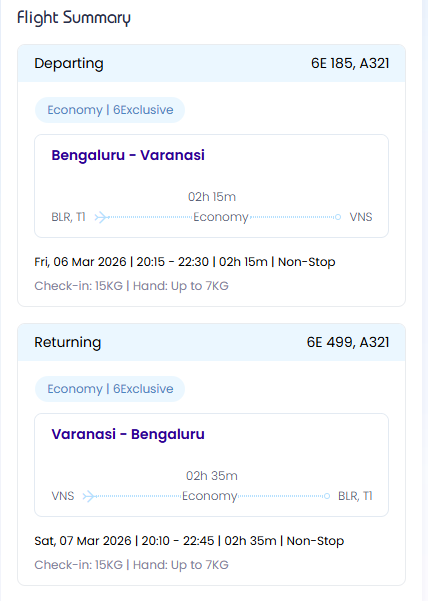

# Varanasi Weekend Trip Plan

## :airplane: Travel to Varanasi (Friday Night)

### Flights

**Man (from Abu Dhabi)**  
- Abu Dhabi → Delhi  
  - Airline: Etihad Airways  
- Delhi → Varanasi  
  - Airline: IndiGo / Air India  

**Travel Companion (from Bangalore)**  
- Bangalore → Varanasi (Direct)  
  - Airline: IndiGo  

### Airport Coordination
- Man arrives first at Varanasi Airport  
- Waits to receive the travel companion  
- Taxi together from airport to hotel  

---

## :hotel: Stay in Varanasi

### Hotel Shortlist  
(Private rooms, calm environment, shared common areas)

1. Taj Nadesar Palace  
2. BrijRama Palace  
3. Suryauday Haveli  

### Transfers
- Taxi: Varanasi Airport → Hotel  
- Evening: Optional coffee or tea in hotel lobby with river view  

---

## :walking: Varanasi Activities — Suggested Flow

### Saturday (Deeper Exploration Day)

**Morning**
- Visit **Kashi Vishwanath Temple**  
  - Early or late morning to avoid peak crowds  
- Walk through **old Varanasi lanes** (Vishwanath Gali area)  
- Visit nearby small neighborhood temples  

**Late Morning / Early Afternoon**
- Lunch at a calm café or trusted vegetarian restaurant  
- Short rest at hotel or independent downtime  

**Afternoon**
- Visit **Sarnath**:
  - Dhamek Stupa  
  - Sarnath Archaeological Museum  
  - Mulagandha Kuti Vihar (Buddhist monastery)  
- Time here can be spent together or independently  

**Evening**
- Quiet walk along selected ghats:
  - Assi Ghat  
  - Panchganga Ghat  
- Sit by the river for observation or reflection  
- Dinner at hotel or a low-key riverside café  

**Optional (Only if energy allows)**
- Attend **Ganga Aarti** as a quiet observer  
- Light classical music or cultural performance  
- Early return to hotel  

---

### Sunday (Light, Flexible, Wind-Down Day)

**Morning**
- Leisurely breakfast at hotel  
- Short ghat walk near the hotel  
- Optional daytime boat ride on the Ganges  

**Late Morning**
- Visit a museum or quiet cultural spot (if not already covered)  
- Independent time:
  - Café visit  
  - Reading or journaling by the river  
  - Hotel common areas  

**Midday**
- Lunch near the hotel  
- Casual browsing of silk or handicraft areas (no shopping pressure)  

**Afternoon**
- Return to hotel  
- Rest, pack, and mentally unwind  
- Final quiet river view from hotel lobby or terrace  

---

## :calendar: Return Journey (Sunday)

### Departure from Varanasi
- Check-out from hotel  
- Taxi to Varanasi Airport  

### Return Flight
- Varanasi → Bangalore (Direct, IndiGo preferred)  

---

## :taxi: Bangalore Airport Taxi Plan

- Collect luggage and pick up pre-booked taxi  
- 🔴 **Drop you safely at home**  
- Continue taxi journey Bangalore → Kanigiri  
- Optional highway rest stop / refreshment  
- Continue drive non-stop with driver breaks as needed  
- Arrive at Kanigiri safely  

---

## :memo: Notes & Reminders

- Pre-book all taxis in advance:
  - Varanasi Airport → Hotel  
  - Hotel → Varanasi Airport  
  - Bangalore Airport → Home drop → Kanigiri  
- **Digi Yatra:**  
  - Once flights are booked, upload boarding passes to Digi Yatra for seamless airport entry and check-in

## :airplane: Flight Options

