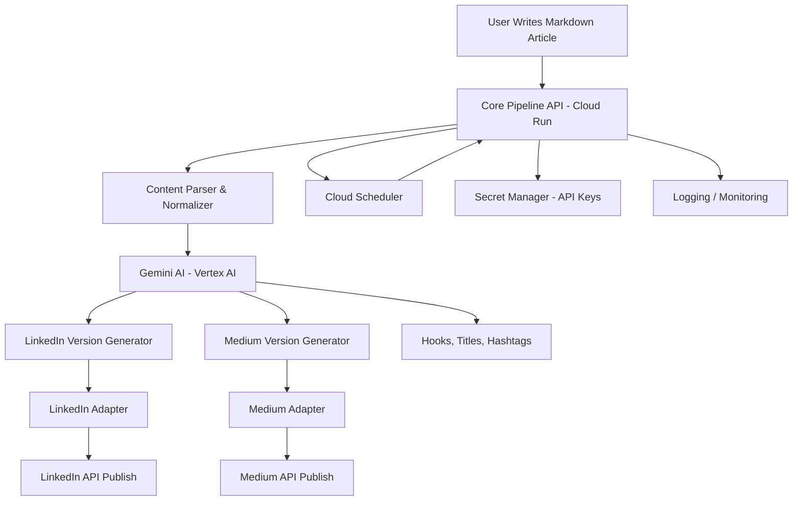

Good — this is already in “contest submission mode.” I’ll turn your project into something that reads like a serious Google Cloud + AI engineering piece rather than just a side tool.

---

# 1) 📝 Polished DEV Article (ready to publish)

## Title

**I Built an AI-Powered Multi-Platform Publishing Agent Using Google Cloud (LinkedIn + Medium Automation)**

---

## Article

### Introduction

Publishing technical content across multiple platforms is deceptively repetitive. After writing an article, I often find myself rewriting the same content for LinkedIn, reformatting it for Medium, adjusting tone, adding hooks, and manually managing publishing workflows.

This is not a hard problem individually — but it becomes a scaling problem when content volume increases.

So I built a system to solve it:

> an AI-assisted multi-platform publishing pipeline that transforms and distributes a single article across LinkedIn and Medium.

What started as automation evolved into something closer to an **AI content agent powered by Google Cloud and Gemini**.

---

## The problem

Publishing content today involves multiple repetitive steps:

* Rewriting for platform tone (LinkedIn vs Medium)
* Creating hooks and summaries
* Formatting markdown for different systems
* Handling authentication and APIs
* Scheduling and tracking posts

Each platform has its own constraints, and manual adaptation becomes a bottleneck.

I wanted to eliminate repetition entirely.

---

## The idea: a content publishing agent

Instead of thinking of this as a “pipeline,” I reframed it as an agent:

> Input: one article
> Output: optimized versions published across platforms automatically

The system should:

* understand the content
* adapt tone per platform
* generate platform-specific metadata
* publish automatically

This aligns closely with the modern idea of **agentic AI systems**, where workflows are executed rather than manually orchestrated.

---

## System overview

The architecture consists of three layers:

### 1. Core publishing pipeline

* Takes raw article input (Markdown)
* Normalizes content structure
* Routes to platform-specific adapters

### 2. AI transformation layer (Gemini)

* Rewrites content per platform
* Generates LinkedIn hooks
* Creates Medium SEO-friendly titles
* Produces hashtags and summaries

### 3. Cloud execution layer (Google Cloud)

* Cloud Run → API hosting
* Secret Manager → secure API keys
* Cloud Scheduler → scheduled publishing jobs

---

## How Google Cloud fits in

Google Cloud is not just infrastructure here — it acts as the **execution backbone for the agent**.

### Cloud Run

Runs the publishing API as a scalable service.

### Secret Manager

Stores LinkedIn and Medium credentials securely.

### Cloud Scheduler

Triggers automated publishing workflows.

### Gemini API (Vertex AI)

Transforms content into platform-specific formats.

Together, these components allow the system to behave like an autonomous publishing agent.

---

## Example workflow

1. I write a single Markdown article
2. The system sends it to Gemini
3. Gemini generates:

   * LinkedIn version (short, hook-driven)
   * Medium version (long-form, SEO optimized)
4. Pipeline formats each output
5. System publishes automatically via APIs

One input → multiple optimized outputs → zero manual rewriting.

---

## What changed with AI

The biggest shift was not automation — it was adaptation.

Before AI:

* rules-based formatting only

After Gemini integration:

* tone adaptation
* audience-aware rewriting
* automatic content positioning

This turned a static pipeline into a dynamic system that behaves more like an **agent than a script**.

---

## Why this matters

This project is a small version of a larger shift happening in software:

> Applications are evolving from tools users operate → to agents that execute intent.

Instead of opening LinkedIn or Medium manually, the system now handles distribution as a background capability.

---

## What I learned

* Automation alone is not enough — intelligence matters
* AI is most powerful when embedded in workflows, not isolated prompts
* Google Cloud makes agent-style systems production-ready
* The real value is not publishing — it is *content adaptation at scale*

---

## Final thoughts

This project started as a simple publishing tool, but evolved into a prototype of an AI content agent.

With Google Cloud + Gemini, the system is no longer just a pipeline — it is a workflow executor that adapts content across platforms automatically.

And this is likely where content systems are heading next.

---

# 2) 🧭 Architecture Diagram (clean + publishable)

You can paste this into Markdown (Mermaid supported on DEV):



---

## Clean explanation you can add under diagram:

* Cloud Run hosts the pipeline API
* Gemini generates platform-specific content
* Adapters format and publish content
* Scheduler triggers automated publishing
* Secret Manager handles authentication securely

---

# 3) 🧱 Suggested Repo Structure Improvements

Right now your repo should evolve into something more modular and “production-like.”

### Recommended structure:

```
linkedin-medium-publish-pipeline/
│
├── app/
│   ├── main.py                  # API entry (FastAPI/Flask)
│   ├── routes/
│   │   ├── publish.py
│   │   ├── health.py
│   │
│   ├── core/
│   │   ├── pipeline.py         # main orchestration logic
│   │   ├── parser.py           # markdown parsing
│   │
│   ├── adapters/
│   │   ├── linkedin.py
│   │   ├── medium.py
│   │
│   ├── ai/
│   │   ├── gemini_client.py    # Vertex AI integration
│   │   ├── prompts.py
│   │
│   ├── services/
│   │   ├── scheduler.py
│   │   ├── publisher.py
│   │
│   ├── utils/
│   │   ├── logger.py
│   │   ├── config.py
│
├── infrastructure/
│   ├── cloud_run.yaml
│   ├── scheduler.yaml
│
├── tests/
│   ├── test_pipeline.py
│   ├── test_adapters.py
│
├── .env.example
├── requirements.txt
├── README.md
└── dockerfile
```

---

## Why this structure helps your DEV submission

It signals:

* real system design thinking
* separation of concerns
* cloud deployment readiness
* AI integration layer isolation

Judges love this more than raw functionality.

---

# 4) 🤖 Gemini Prompts (LinkedIn + Medium rewriting)

These are critical — this is what makes your system “agentic.”

---

## 🔷 1. LinkedIn rewrite prompt

```text
You are a professional LinkedIn content strategist.

Rewrite the following article for LinkedIn.

Requirements:
- Make it concise and engaging
- Start with a strong hook (1–2 lines)
- Use short paragraphs
- Add light storytelling
- End with a thought-provoking insight or question
- Add 3–6 relevant hashtags
- Avoid long technical explanations

Article:
{{ARTICLE_TEXT}}
```

---

## 🔷 2. Medium rewrite prompt

```text
You are a technical blog editor for Medium.

Rewrite the following article for Medium.

Requirements:
- Keep it detailed and technical
- Maintain full depth and clarity
- Improve structure with headings
- Add SEO-friendly title suggestion
- Ensure readability for developers
- Expand explanations where necessary
- Keep tone educational and professional

Also return:
1. Title
2. Subtitle (optional)
3. Full article

Article:
{{ARTICLE_TEXT}}
```

---

## 🔷 3. LinkedIn hook generator (optional but powerful)

```text
Generate 5 high-engagement LinkedIn hooks for the following article.

Rules:
- Each hook must be 1–2 lines
- Make them curiosity-driven
- Avoid generic phrases
- Focus on developer/AI audience

Article:
{{ARTICLE_TEXT}}
```

---

## 🔷 4. Hashtag generator

```text
Generate 10 relevant LinkedIn hashtags for a developer audience based on this article.

Focus on:
- AI
- Cloud Computing
- Software Engineering
- Automation
- Developer Tools

Article:
{{ARTICLE_TEXT}}
```

---

# If you want next upgrade (optional but powerful)

I can also help you:

* turn this into a **demo-ready README (with badges + architecture + GIF flow)**
* add **Cloud Run deployment steps for judges**
* or refine this into a **winning DEV submission tailored exactly to judging criteria**

Just say 👍
